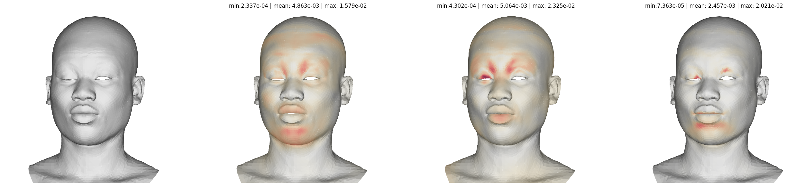

# Matplotlib render
render 3D mesh with matplotlib library \
I made this just for fun, so the code is a bit messy and there are things that still needs to be done too!


Reference: https://matplotlib.org/matplotblog/posts/custom-3d-engine/


## TODOs
- Image
    - [x] curling based on normal
    - [ ] rendering mesh difference
    - [ ] gouraud rendering with `matplotlib.tri`
- Animation
    - [ ] add slider feature to tour around the animation frames
    - [ ] add feature for comparing difference between two animation

# Requirements
```
pip install -r requirements.txt
pip install .
```


# How to use
```python
from matplotrender import *
import trimesh
mesh = trimesh.load('your_mesh_file.obj')
print(mesh.vertices.shape)
>>> (5023, 3)

# figure size
SIZE = 2

# mesh that you wanna render
v_list=[ mesh.vertices ]
f_list=[ mesh.faces ]

# xyz Euler angle to rotate the mesh
rot_list=[ [0,0,0] ]

plot_mesh_image(v_list, f_list, rot_list=rot_list, size=SIZE)
plot_mesh_image(v_list, f_list, rot_list=rot_list, size=SIZE, mode='normal')
plot_mesh_image(v_list, f_list, rot_list=rot_list, size=SIZE, mode='shade')
```


You can also render video! \
let's say you have an mesh animation saved as a npy file as below:
```python
# your mesh animation
vertices_anim = np.load('your_mesh_animation.npy')
print(vertices_anim)
>>> (100, 5023, 3)
```
you can use `plot_mesh_video` to render a video.
```python
v_list=[ vertices_anim ]
f_list=[ mesh.faces ]
plot_mesh_video(
        v_list, 
        f_list, 
        size=2, 
        bg_black=False,
    )
```

you can also mux audio too!
```python
audio_dir='your_path/audio.wav'
v_list=[ vertices_anim ]
f_list=[ mesh.faces ]
plot_mesh_video(
        v_list, 
        f_list, 
        size=2, 
        bg_black=False,
        audio_dir=audio_dir
    )
```

### NEW!
you can render MSE between meshes (only for same topology)
```python
from matplotrender import *
import trimesh

mesh0 = trimesh.load('your_mesh_file0.obj')
mesh1 = trimesh.load('your_mesh_file1.obj')
mesh2 = trimesh.load('your_mesh_file2.obj')
mesh3 = trimesh.load('your_mesh_file3.obj')

v_list = [mesh1.vertices, mesh2.vertices, mesh3.vertices]
f_list = [mesh1.faces, mesh2.faces, mesh3.faces]
v0 = mesh0.vertices # (V, 3)

plot_image_array_diff3(
    v_list, 
    f_list, 
    v0,
    rot=[0,-10,0], 
    bg_black=False,
)
```
The meshes will be rendered from left to right(mesh0, mesh1, mesh2, mesh3)

