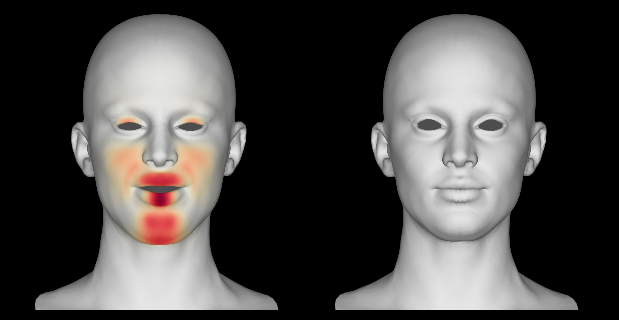
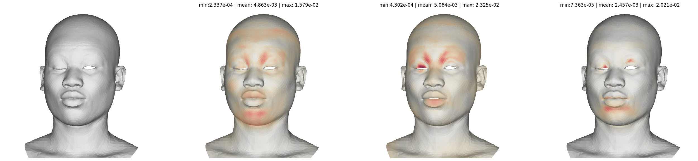

# Matplotlib render
Render 3D meshes with matplotlib — no OpenGL required.

Reference: https://matplotlib.org/matplotblog/posts/custom-3d-engine/

## TODOs
- Image
    - [x] wireframe / shading / normal rendering
    - [x] rendering mesh difference (e.g. L2 error)
    - [x] gouraud rendering with `matplotlib.tri`
    - [x] torch tensor inputs supported
    - [ ] depth sorting triangles (minor artifacts remain)
- Animation
    - [x] mesh animation video (`plot_mesh_video`)
    - [x] diff video: single reference vs sequences (`render_video_mesh_diff`)
    - [x] diff video: anchor sequence vs multiple src sequences (`render_video_mesh_diffs`)
    - [ ] interactive slider UI

# Requirements
```
pip install -r requirements.txt
pip install .
```

# Functions

## plot_mesh_image
Renders a static image of one or more meshes side by side.

```python
from matplotrender import plot_mesh_image
import trimesh, numpy as np

mesh = trimesh.load('your_mesh.obj', force='mesh')
v_list = [mesh.vertices]
f_list = [mesh.faces]
rot_list = [[0, 30, 0]]  # xyz Euler angles per mesh

plot_mesh_image(v_list, f_list, rot_list=rot_list, norm=True, mode='mesh')   # wireframe
plot_mesh_image(v_list, f_list, rot_list=rot_list, norm=True, mode='shade')  # flat shading
plot_mesh_image(v_list, f_list, rot_list=rot_list, norm=True, mode='normal') # normal map
```


## plot_mesh_gouraud
Gouraud shading via `matplotlib.tri`. Accepts both numpy arrays and torch tensors.
Pass `Cs` (per-vertex logits `(V, num_classes)`) to color by segmentation label.

```python
from matplotrender import plot_mesh_gouraud
import torch

# numpy
plot_mesh_gouraud([mesh.vertices], [mesh.faces], rot_list=[[0, 30, 0]], norm=True, mode='shade')

# torch tensors work directly
V_t = torch.tensor(mesh.vertices, dtype=torch.float32)
F_t = torch.tensor(mesh.faces, dtype=torch.long)
plot_mesh_gouraud([V_t], [F_t], rot_list=[[0, 30, 0]], norm=True, mode='shade')

# segmentation colors: Cs is (V, num_classes), argmax used for color
C_seg = torch.randn(mesh.vertices.shape[0], 5)
plot_mesh_gouraud([V_t], [F_t], Cs=[C_seg], rot_list=[[0, 30, 0]], norm=True)
```



## plot_image_array_diff3
Renders multiple meshes colored by per-face L2 distance from a reference mesh `D`.

```python
from matplotrender import plot_image_array_diff3

v_list = [mesh1.vertices, mesh2.vertices, mesh3.vertices]
f_list = [mesh1.faces, mesh2.faces, mesh3.faces]

plot_image_array_diff3(
    v_list, f_list,
    D=mesh0.vertices,  # reference
    rot=(0, -10, 0),
    norm=True,
    bg_black=False,
)
```

Layout: `[ ref | mesh1 | mesh2 | mesh3 ]`



## plot_mesh_video
Renders a mesh animation as `.mp4`. Each element in `Vs` is a `(T, V, 3)` sequence rendered as a separate panel.

```python
from matplotrender import plot_mesh_video

# vertices_anim: (T, V, 3)
vertices_anim = np.load('your_mesh_animation.npy')

plot_mesh_video(
    [vertices_anim], [mesh.faces],
    norm=True, size=4, fps=30,
    savedir='out', savename='my_video',
)

# with audio mux
plot_mesh_video(
    [vertices_anim], [mesh.faces],
    norm=True, size=4, fps=30,
    audio_dir='path/to/audio.wav',
    savedir='out', savename='my_video_audio',
)
```

## render_video_mesh_diff
Renders a comparison video: reference `D` on the left, one or more sequences `Vs` on the right, colored by per-face L2 error.
When `D=None`, the **first frame of `Vs[0]`** is used as a static reference.

```python
from matplotrender import render_video_mesh_diff

# pred_seq, gt_seq: (T, V, 3)
render_video_mesh_diff(
    Vs=[pred_seq],
    Fs=[faces],
    D=gt_seq,        # GT reference sequence (left panel)
    norm=True, size=4, fps=30,
    savedir='out', savename='diff_video',
)

# D=None → first frame of Vs[0] used as static reference
render_video_mesh_diff(
    Vs=[pred_seq],
    Fs=[faces],
    D=None,
    norm=True, size=4, fps=30,
    savedir='out', savename='diff_static',
)
```

## render_video_mesh_diffs
Compares multiple `src` sequences against a single `anchor` sequence frame by frame.
Per-face L2 distance is shown as color on each src mesh.
The colormap is normalized **globally** across all frames for consistent comparison.

```python
from matplotrender import render_video_mesh_diffs

# pred_seq_a, pred_seq_b, gt_seq: (T, V, 3)
render_video_mesh_diffs(
    src_vs=[pred_seq_a, pred_seq_b],
    src_fs=[faces, faces],
    anc_vs=gt_seq,   # anchor / GT
    anc_fs=faces,
    norm=True, size=4, fps=30,
    savedir='out', savename='diffs_video',
)
```

Layout per frame: `[ anchor | src_0 | src_1 | ... ]`
A shared colorbar (L2 distance) is added to the right of the figure.
